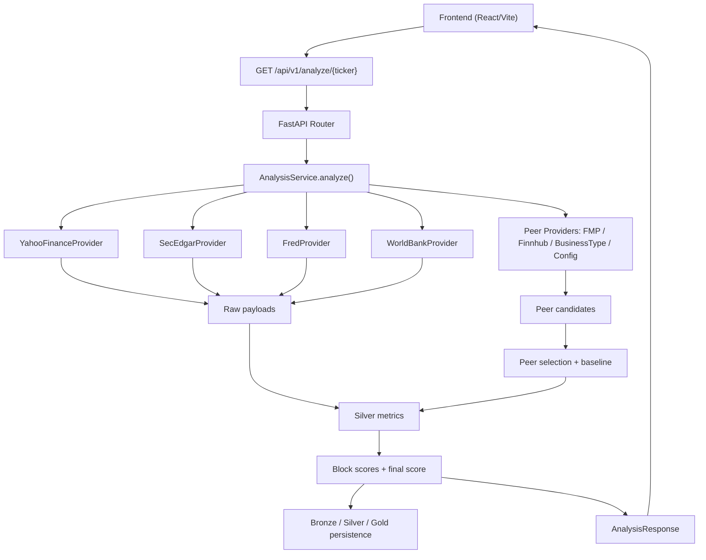

# Полная техническая документация системы инвестиционного скоринга

## 1. Назначение системы

Эта программа принимает тикер публичной компании, собирает живые рыночные, фундаментальные и макроэкономические данные, подбирает сопоставимую peer-group, строит нормализованный набор метрик и рассчитывает итоговую оценку инвестиционной привлекательности по шкале от `0` до `100`.

Система не пытается предсказывать будущую цену акции напрямую. Она делает более узкую и более инженерную задачу:

1. Собрать входные данные из нескольких источников.
2. Привести их к единому формату.
3. Построить сопоставимую базу сравнения.
4. Превратить набор финансовых признаков в прозрачный score.
5. Отдать не только число, но и объяснимый payload для UI.

Смысл системы не в том, чтобы заменить человека-инвестора. Ее задача в том, чтобы:

- быстро построить сопоставимую картину по компании;
- явно показать сильные и слабые стороны;
- не сломаться из-за частично пустых данных;
- не давать одному аномальному peer испортить всю оценку;
- сохранять следы расчета в слоях `bronze / silver / gold`.

## 2. Активная архитектура исполнения

На сегодня основной backend-путь проходит через `FastAPI` и активный сервис [analysis_runtime_service.py](/D:/Downloads/Dev/invest/backend/app/services/analysis_runtime_service.py).

Маршрут запроса:

1. Frontend вызывает `GET /api/v1/analyze/{ticker}`.
2. Маршрут из [routes.py](/D:/Downloads/Dev/invest/backend/app/api/routes.py) делегирует расчет `AnalysisService`.
3. `AnalysisService`:
   - валидирует тикер;
   - проверяет in-memory cache готового анализа;
   - дергает внешние провайдеры;
   - строит профиль компании;
   - строит peer-group;
   - рассчитывает silver-метрики;
   - рассчитывает block scores;
   - собирает финальный `AnalysisResponse`;
   - пишет слои `bronze`, `silver`, `gold` в PostgreSQL;
   - кэширует готовый ответ.
4. Frontend отрисовывает payload без дополнительной бизнес-логики по финансовым формулам.

Важно: в кодовой базе есть файл `analysis_live_service.py`, но API в текущем состоянии привязан именно к `analysis_runtime_service.py`. То есть активный production-like path сейчас проходит через runtime service.

### 2.1 Схема потока



## 3. Карта проекта

### 3.1 Backend

- [backend/app/main.py](/D:/Downloads/Dev/invest/backend/app/main.py)  
  Точка входа FastAPI, CORS, middleware, startup/shutdown.

- [backend/app/api/routes.py](/D:/Downloads/Dev/invest/backend/app/api/routes.py)  
  HTTP-роуты: `health`, `cache/clear`, `analyze/{ticker}`.

- [backend/app/services/analysis_runtime_service.py](/D:/Downloads/Dev/invest/backend/app/services/analysis_runtime_service.py)  
  Главная бизнес-логика: сбор данных, peer pipeline, silver-метрики, scoring, warnings, UI payload.

- [backend/app/services/analysis_safety.py](/D:/Downloads/Dev/invest/backend/app/services/analysis_safety.py)  
  Набор математических helper-функций, классификация business type, normalization primitives.

- [backend/app/services/providers/live_clients.py](/D:/Downloads/Dev/invest/backend/app/services/providers/live_clients.py)  
  HTTP-провайдеры Yahoo, SEC, FRED, World Bank.

- [backend/app/services/providers/peer_providers.py](/D:/Downloads/Dev/invest/backend/app/services/providers/peer_providers.py)  
  Источники peer-кандидатов: FMP, Finnhub, business-type fallback, config fallback.

- [backend/app/config/scoring.json](/D:/Downloads/Dev/invest/backend/app/config/scoring.json)  
  Конфигурация block weights и caps.

- [backend/app/config/peer_groups.json](/D:/Downloads/Dev/invest/backend/app/config/peer_groups.json)  
  Конфигурация sector/industry-based peer rules.

- [backend/app/schemas/analysis.py](/D:/Downloads/Dev/invest/backend/app/schemas/analysis.py)  
  Pydantic-схемы ответа API.

- [backend/app/db/models.py](/D:/Downloads/Dev/invest/backend/app/db/models.py)  
  SQLAlchemy-модели таблиц `bronze_snapshots`, `silver_analyses`, `gold_scores`.

- [backend/app/repositories/analysis_repository.py](/D:/Downloads/Dev/invest/backend/app/repositories/analysis_repository.py)  
  Слой записи данных в БД.

- [backend/app/utils/cache.py](/D:/Downloads/Dev/invest/backend/app/utils/cache.py)  
  In-memory TTL cache.

### 3.2 Frontend

- [frontend/src/main.tsx](/D:/Downloads/Dev/invest/frontend/src/main.tsx)  
  Точка входа React.

- [frontend/src/AppScreen.tsx](/D:/Downloads/Dev/invest/frontend/src/AppScreen.tsx)  
  Основной экран приложения, orchestration UI.

- [frontend/src/types.ts](/D:/Downloads/Dev/invest/frontend/src/types.ts)  
  Типы frontend payload.

- [frontend/src/components/PeerTable.tsx](/D:/Downloads/Dev/invest/frontend/src/components/PeerTable.tsx)  
  Таблица peer-group и статусы baseline.

- [frontend/src/components/MetricGridSafe.tsx](/D:/Downloads/Dev/invest/frontend/src/components/MetricGridSafe.tsx)  
  Карточки основных метрик.

- [frontend/src/components/BreakdownBarsSafe.tsx](/D:/Downloads/Dev/invest/frontend/src/components/BreakdownBarsSafe.tsx)  
  Block breakdown score/weight.

- [frontend/src/components/MacroPanel.tsx](/D:/Downloads/Dev/invest/frontend/src/components/MacroPanel.tsx)  
  Макро-панель.

- [frontend/src/components/TrendChart.tsx](/D:/Downloads/Dev/invest/frontend/src/components/TrendChart.tsx)  
  График выручки и FCF.

- [frontend/src/components/ScoreRing.tsx](/D:/Downloads/Dev/invest/frontend/src/components/ScoreRing.tsx)  
  Кольцевой индикатор итогового score.

## 4. Источники данных и почему выбраны именно они

Система использует четыре основные категории источников:

1. Рыночные данные.
2. Официальные фундаментальные данные.
3. Макроэкономические данные.
4. Внешние и внутренние источники peer-кандидатов.

### 4.1 Yahoo Finance

Используется как быстрый рыночный источник.

Из него берутся:

- текущая цена акции `current_price`;
- история месячных закрытий за `5y`;
- доходность за 1 год;
- доходность за 5 лет;
- snapshot market cap;
- snapshot shares outstanding;
- валюта quote.

Почему Yahoo здесь уместен:

- он хорошо подходит для market layer;
- даёт цену и историю цен без необходимости собирать отдельный market data stack;
- помогает оценить market cap через quote market cap и через `price * shares`.

Yahoo в этой системе не считается главным источником фундаментала. Его роль — рыночная оболочка вокруг SEC-фундаментала.

### 4.2 SEC EDGAR

Это главный источник фундаментала.

Берутся:

- выручка;
- операционная прибыль;
- прибыль до налогообложения;
- налоговый расход;
- чистая прибыль;
- активы;
- обязательства;
- equity;
- current assets;
- current liabilities;
- cash;
- debt;
- shares outstanding;
- SIC и `sicDescription`.

Почему SEC выбран как фундаментальный backbone:

- это официальный источник раскрытия;
- он даёт более контролируемую методологию, чем случайный рыночный snapshot;
- на его основе удобно пересчитывать derived metrics самостоятельно, а не слепо доверять чужим precomputed ratios.

### 4.3 FRED

Используется для макропоказателей США:

- `FEDFUNDS`;
- `UNRATE`;
- `CPIAUCSL`.

Особенно важно, что инфляция берётся не как сырой CPI index, а как `year-over-year percent change`, что методологически корректнее для scoring.

### 4.4 World Bank

Используется для `GDP growth` США.

Это отдельный макроисточник, который закрывает компонент роста экономики, не зависящий от Yahoo или SEC.

### 4.5 Peer providers

Peer universe формируется не из одного источника, а как объединение нескольких кандидатов:

1. `FmpPeerProvider`
2. `FinnhubPeerProvider`
3. `BusinessTypePeerProvider`
4. `ConfigPeerProvider`

Это сделано намеренно: один источник peers почти всегда оказывается либо слишком узким, либо слишком шумным, либо rate-limited.

## 5. Главная идея выбора показателей

Показатели подобраны не по принципу “взять всё, что есть”, а по принципу покрытия шести разных смысловых измерений компании:

1. Насколько бизнес прибыльный.
2. Насколько он устойчив.
3. Насколько его оценка дорогая или дешёвая относительно peers.
4. Насколько растёт операционная база.
5. Как акция вела себя на рынке.
6. В какой макросреде всё это происходит.

Это даёт блоки:

- `Profitability`
- `Stability`
- `Valuation`
- `Growth`
- `Market`
- `Macro`

Такой выбор полезен тем, что:

- score не опирается на один коэффициент;
- valuation не доминирует над операционным качеством;
- market momentum не заменяет фундаментал;
- макро не ломает оценку, а корректирует её.

## 6. Как именно рассчитываются все показатели

Ниже перечислены активные формулы в системе.

### 6.1 Базовая безопасная дробь

Все отношения строятся через `safe_ratio`:

```text
safe_ratio(numerator, denominator):
    если numerator is None -> None
    если denominator is None -> None
    если denominator == 0 -> None
    если denominator < 0 и allow_negative_denominator = False -> None
    иначе numerator / denominator
```

Смысл: система предпочитает `None`, а не “математически возможный, но экономически бессмысленный” результат.

### 6.2 Рыночная капитализация

Система не хранит market cap как абсолютную истину из одного источника. Она строит его как нормализованную диагностическую величину.

Источники кандидатов:

1. `yahoo_quote`  
   `market_cap_bln_quote`

2. `price_x_sec_shares`  
   `current_price * sec_shares_outstanding / 1000`

3. `price_x_quote_shares`  
   `current_price * yahoo_quote_shares / 1000`

4. supplemental snapshots из FMP/Finnhub

Выбор:

```text
если есть >= 2 cross-source кандидата, не начинающихся на "price_x_":
    chosen = median(cross_source_values)
иначе:
    chosen = median(all_valid_values)
```

Статус:

```text
if chosen is None -> invalid
if chosen < 0.01 or chosen > 7500 -> invalid
if max(all_values) / min(all_values) > 3 -> suspect
else -> valid
```

Поддерживаемая валюта сейчас только `USD`. Неподдерживаемая валюта не конвертируется автоматически, а даёт warning и не используется как trusted source.

### 6.3 P/E

```text
P/E = market_cap_bln / net_income_bln
```

Используется не как vendor-ratio, а как производный коэффициент поверх:

- рыночной капитализации;
- чистой прибыли из SEC.

### 6.4 P/B

```text
P/B = market_cap_bln / equity_bln
```

Тоже вычисляется локально.

### 6.5 ROE

Display-значение:

```text
ROE = (net_income_bln / equity_bln) * 100
```

Но есть ещё `roe_score_pct`, то есть то, что реально идёт в scoring.

Логика:

1. Если equity неинтерпретируемый, ROE становится unreliable.
2. Для небанковских компаний ROE также считается unreliable, если equity слишком мал относительно market cap.
3. Для bank-like компаний это правило отключено, потому что для банков ROE — базовая профильная метрика, а не подозрительный побочный коэффициент.
4. Если ROE unreliable, но есть ROIC, scoring может использовать ROIC как substitute input.

### 6.6 ROIC

Сначала рассчитывается налоговая ставка:

```text
effective_tax_rate = tax_expense / pretax_income
tax_rate = clamp(effective_tax_rate, 0, 0.35)
если tax facts неполные и operating income есть:
    tax_rate = 0.21
```

Затем:

```text
NOPAT = operating_income * (1 - tax_rate)

invested_capital = total_debt + equity - cash
если invested_capital <= 0 -> None

ROIC = (NOPAT / invested_capital) * 100
```

### 6.7 EBIT Margin

```text
EBIT Margin = operating_income / revenue
```

В процентах.

### 6.8 FCF Margin

Сначала:

```text
FCF = CFO - CAPEX
```

Затем:

```text
FCF Margin = FCF / revenue
```

Если периоды CFO и CAPEX не удалось корректно состыковать, FCF не считается и это явно попадает в warnings.

### 6.9 Debt / Equity

База долга:

```text
total_debt = long_term_debt + current_debt
fallback_debt = max(liabilities - equity, 0)
debt_base = total_debt if total_debt > 0 else fallback_debt

Debt/Equity = debt_base / equity
```

### 6.10 Current Ratio

```text
Current Ratio = current_assets / current_liabilities
```

### 6.11 Revenue Growth

Система не сравнивает периоды вслепую. Перед расчётом проверяется:

- одинаков ли `period_type`;
- совпадает ли `fiscal_period`, если он известен.

Только потом:

```text
Revenue Growth = ((revenue_t / revenue_t-1) - 1) * 100
```

Если периоды не совпадают по типу, метрика не считается.

### 6.12 Revenue CAGR-like

Если доступна история выручки из нескольких годовых периодов:

```text
growth_ratio = latest_revenue / earliest_revenue
interval_count = number_of_points - 1

Revenue CAGR-like = ((growth_ratio ** (1 / interval_count)) - 1) * 100
```

Это не “официальный CAGR-модуль”, а компактный способ оценить траекторию роста по короткой годовой истории.

### 6.13 Доходность цены за 1 и 5 лет

Из Yahoo берётся месячная история закрытий.

Формулы:

```text
5Y Return = ((last_close / first_close) - 1) * 100
1Y Return = ((last_close / close_12_months_ago) - 1) * 100
```

### 6.14 Макро-показатели

#### Fed Funds

Берётся latest value.

#### Unemployment

Берётся latest value.

#### Inflation

Не используется сырой CPI index. Используется `YoY inflation`:

```text
Inflation YoY = ((CPI_now / CPI_about_1_year_ago) - 1) * 100
```

#### GDP Growth

Берётся latest non-null World Bank value.

## 7. Нормализация признаков в шкалу 0–100

Система сознательно разделяет типы признаков на:

- `positive`: больше лучше;
- `inverse`: меньше лучше;
- `relative valuation`: специальная функция для премии/дисконта.

### 7.1 score_positive

```text
score_positive(value, cap) =
    clamp(value, 0, cap) / cap * 100
```

Интерпретация: всё выше `cap` считается просто “очень хорошо”, но не даёт бесконечного бонуса.

### 7.2 score_inverse

```text
score_inverse(value, cap) =
    100 - (clamp(value, 0, cap) / cap * 100)
```

Интерпретация: чем ниже долг, тем выше score.

### 7.3 premium_pct

```text
premium_pct(value, benchmark) =
    ((value / benchmark) - 1) * 100
```

### 7.4 score_relative_valuation

Это одна из самых важных функций модели.

```text
clamped = clamp(premium_pct, -cap, cap)

если clamped <= 0:
    score = 60 + abs(clamped) / cap * 40
иначе:
    score = 60 - clamped / cap * 60
```

Следствия:

- справедливая или чуть более дешёвая оценка стартует от `60`, а не от `50`;
- дисконт может поднять score к `100`;
- сильная переоценка тянет score к `0`;
- функция асимметрична и специально благоприятствует умеренной недооценке.

## 8. Конфиг scoring и веса блоков

Из [scoring.json](/D:/Downloads/Dev/invest/backend/app/config/scoring.json):

```text
profitability = 0.27
stability     = 0.19
valuation     = 0.20
growth        = 0.19
market        = 0.08
macro         = 0.07
```

Caps:

```text
roe_pct              = 50
roic_pct             = 35
ebit_margin_pct      = 40
debt_to_equity       = 2.5
current_ratio        = 2.5
revenue_growth_pct   = 35
fcf_margin_pct       = 30
five_year_return_pct = 250
pe_premium_pct       = 100
pb_premium_pct       = 100
```

Для bank-like компаний активны дополнительные sector-specific caps:

```text
roe_cap    = min(50, 25) = 25
growth_cap = min(35, 15) = 15
```

Это сделано потому, что:

- ROE 15–20% у банка — уже очень сильный показатель;
- рост выручки банка нельзя оценивать той же шкалой, что growth software-компании.

## 9. Почему блоки выбраны именно так

### 9.1 Profitability

Смысл блока: измерить, насколько качественно компания превращает капитал и операционную базу в прибыль.

Активные признаки:

- `ROE`
- `ROIC`
- `EBIT Margin`

Почему именно они:

- `ROE` показывает эффективность работы на equity;
- `ROIC` лучше отражает операционную отдачу на капиталовую базу;
- `EBIT Margin` показывает качество операционной экономики бизнеса.

Для банков блок упрощён до `ROE`, потому что:

- `ROIC` и `EBIT margin` для банков хуже интерпретируются;
- `ROE` и устойчивость доходной базы там важнее.

### 9.2 Stability

Смысл блока: понять, насколько компания уязвима к стрессу баланса и cash conversion.

Небанковский режим:

- `Debt/Equity`
- `Current Ratio`
- `FCF Margin`

Банковский режим:

- `ROE`
- `Revenue Growth`
- третий слот пустой по весу-носителю

Почему так:

- generic debt/current ratio плохо сопоставимы для банка;
- банк оценивается скорее по способности стабильно зарабатывать и удерживать разумный темп бизнеса.

### 9.3 Valuation

Смысл блока: оценить, как дорого или дёшево рынок оценивает компанию относительно сравнимой группы.

Используются:

- premium/discount к peer baseline по `P/E`;
- premium/discount к peer baseline по `P/B`.

Почему именно relative valuation:

- абсолютный `P/E` без контекста сектора часто бесполезен;
- у компаний разного типа “нормальные” мультипликаторы сильно отличаются;
- relative baseline лучше отражает дороговизну внутри сопоставимой группы.

### 9.4 Growth

Смысл блока: оценить реальный рост бизнеса, а не только рыночный энтузиазм.

Небанковский режим:

- `Revenue Growth`
- `Revenue CAGR-like`
- `FCF Margin`

Банковский режим:

- `Revenue Growth`
- `Revenue CAGR-like`

Почему FCF входит в growth у небанковских компаний:

- рост без денежного подтверждения часто некачественный;
- FCF margin помогает отличать “рост с cash support” от “роста любой ценой”.

### 9.5 Market

Смысл блока: добавить отражение того, как акция вела себя на рынке.

Признаки:

- `1Y return`
- `5Y return`

Это не фундаментальный блок, поэтому его базовый вес небольшой.

### 9.6 Macro

Смысл блока: не предсказывать макро, а корректировать общую картину под текущую среду.

Используются:

- ставка;
- инфляция;
- безработица;
- GDP growth.

## 10. Как строится score по каждому блоку

### 10.1 Profitability

Небанковский режим:

```text
profitability_components = [
    (score_positive(roe_score_pct, roe_cap), 0.40),
    (score_positive(roic_pct, 35),          0.35),
    (score_positive(ebit_margin_pct, 40),  0.25),
]
```

Банковский режим:

```text
profitability_components = [
    (score_positive(roe_score_pct, 25), 1.00),
]
```

### 10.2 Stability

Небанковский режим:

```text
stability_components = [
    (score_inverse(debt_to_equity, 2.5), 0.55),
    (score_positive(current_ratio, 2.5), 0.20),
    (score_positive(fcf_margin_pct, 30), 0.25),
]
```

Банковский режим:

```text
stability_components = [
    (score_positive(roe_score_pct, 25),        0.55),
    (score_positive(revenue_growth_pct, 15),   0.25),
    (None,                                     0.20),
]
```

### 10.3 Valuation

```text
valuation_components = [
    (score_relative_valuation(pe_premium_pct, 100), 0.55),
    (score_relative_valuation(pb_premium_pct, 100), 0.45),
]
```

Важная деталь: valuation может работать частично. Если доступен хотя бы один из двух multiples, блок не отключается автоматически.

### 10.4 Growth

Небанковский режим:

```text
growth_components = [
    (score_positive(revenue_growth_pct, growth_cap),    0.55),
    (score_positive(revenue_cagr_like_pct, growth_cap), 0.20),
    (score_positive(fcf_margin_pct, 30),                0.25),
]
```

Банковский режим:

```text
growth_components = [
    (score_positive(revenue_growth_pct, 15),    0.55),
    (score_positive(revenue_cagr_like_pct, 15), 0.20),
]
```

### 10.5 Market

```text
market_components = [
    (score_positive(one_year_return_pct, 60),   0.45),
    (score_positive(five_year_return_pct, 250), 0.55),
]
```

### 10.6 Macro

```text
fed_component          = max(0, 100 - fed_funds_rate_pct * 12)
inflation_component    = max(0, 100 - abs(inflation_pct - 2.0) * 25)
unemployment_component = max(0, 100 - unemployment_pct * 10)
gdp_component          = clamp(gdp_growth_pct, 0, 4) / 4 * 100

macro_components = [
    (fed_component,          0.30),
    (inflation_component,    0.25),
    (unemployment_component, 0.20),
    (gdp_component,          0.25),
]
```

## 11. Coverage, caps и перераспределение весов

Система не просто “ставит ноль” пустой метрике. Она считает coverage и динамически перераспределяет веса.

### 11.1 weighted_score

```text
weighted_score = sum(value * normalized_weight)
normalized_weight = weight / sum(weights_of_non_null_components)
```

### 11.2 coverage_ratio

```text
coverage_ratio = min(
    valid_weight / total_weight,
    valid_count / total_count
)
```

Это более консервативно, чем просто доля по весам.

### 11.3 apply_low_confidence_cap

Если coverage блока ниже `0.5`, score блока дополнительно ограничивается:

```text
max_score = 60 + coverage * 50
final_score = min(raw_score, max_score)
```

Это защита от ситуации “одна хорошая метрика даёт слишком высокий score целому блоку”.

### 11.4 Effective block weights

Базовые веса из конфига не применяются напрямую. Для каждого блока строится `weighted_config`.

```text
profitability_weight =
    config_profitability_weight
    * coverage_ratio(profitability_components)
    * profitability_reliability_multiplier

stability_weight =
    config_stability_weight
    * coverage_ratio(stability_components)

valuation_weight =
    config_valuation_weight
    * coverage_ratio(valuation_components)
    * peer_confidence_multiplier
    * valuation_mode_multiplier

growth_weight =
    config_growth_weight
    * coverage_ratio(growth_components)

market_weight =
    config_market_weight
    * coverage_ratio(market_components)

macro_weight =
    config_macro_weight
    * coverage_ratio(macro_components)
```

После этого веса нормализуются функцией `normalize_weights` только по тем блокам, у которых score не `None`.

Это означает:

- если макро не пришло, вес не пропадает, а перераспределяется;
- если valuation частично пустой, его вес становится меньше;
- если profitability unreliable, блок автоматически ослабляется.

## 12. Как строится профиль компании

Перед peer-selection система не полагается только на `sector` и `industry`, пришедшие извне. Она строит свой `company_profile`.

Поля профиля:

- `ticker`
- `company`
- `sector`
- `industry`
- `sic`
- `business_type`
- `business_type_confidence`
- `business_type_reason`

### 12.1 Зачем нужен business type

Проблема sector-only подхода в том, что один и тот же сектор слишком широк:

- Technology содержит и semis, и enterprise software, и consumer hardware.
- Financial Services содержит банки, страховщиков, asset managers и payments.

Поэтому система вводит промежуточную сущность `business_type`.

### 12.2 Источники business type

Business type определяется комбинацией:

1. `ticker overrides`
2. keyword rules
3. sector fallback

### 12.3 Ticker overrides

Есть жёсткие override-правила, например:

- `AAPL -> CONSUMER_HARDWARE_ECOSYSTEM`
- `MSFT -> ENTERPRISE_SOFTWARE`
- `TSLA/GM/F/TM/... -> AUTO_MANUFACTURER`
- `V/MA/AXP/PYPL -> PAYMENTS`

Это сделано потому, что по одним только SIC и industry некоторые компании классифицируются неустойчиво.

### 12.4 Keyword rules

Если ticker override не сработал, система ищет ключевые фрагменты в:

- sector
- industry
- company
- description
- sic

Business types включают:

- `BANK`
- `INSURANCE`
- `ASSET_MANAGER`
- `PAYMENTS`
- `AUTO_MANUFACTURER`
- `SEMICONDUCTORS`
- `ENTERPRISE_SOFTWARE`
- `CONSUMER_HARDWARE_ECOSYSTEM`
- `SOFTWARE`
- `INTERNET_PLATFORM`
- `E_COMMERCE`
- `RESTAURANTS`
- `HOME_IMPROVEMENT_RETAIL`
- `RETAIL`
- `OIL_GAS`
- `MINING`
- `REIT`
- `PHARMA`
- `HEALTHCARE`
- `INDUSTRIALS`
- `UTILITIES`

### 12.5 Почему был добавлен `_matches_fragment`

Для коротких буквенных фрагментов система использует word-boundary matching, чтобы избежать ложных совпадений наподобие:

```text
"erp" inside "CATERPILLAR"
```

Это важная деталь: без неё `CAT` ошибочно попадал в `ENTERPRISE_SOFTWARE`.

## 13. Business-type universes

У каждого business type есть свой “безопасный universe”, который система может использовать как fallback.

Примеры:

- `BANK`: `JPM, BAC, C, WFC, PNC, USB, GS, MS`
- `PAYMENTS`: `V, MA, PYPL, AXP, FI, GPN`
- `AUTO_MANUFACTURER`: `TSLA, GM, F, TM, HMC, STLA, RACE, RIVN, LI, NIO, XPEV, LCID`
- `CONSUMER_HARDWARE_ECOSYSTEM`: `AAPL, DELL, HPQ, SONY, SMSN, MSFT`
- `PHARMA`: `LLY, PFE, MRK, JNJ, BMY, ABBV`
- `INDUSTRIALS`: `GE, CAT, DE, HON, ETN, EMR`
- `UTILITIES`: `NEE, DUK, SO, AEP, XEL, D`

Это не “истина о мире”, а curated safe universe, который нужен как страховка от плохих внешних peers.

## 14. Peer pipeline: полный алгоритм

### 14.1 Источники кандидатов

Провайдеры идут в таком порядке:

1. `FmpPeerProvider`
2. `FinnhubPeerProvider`
3. `BusinessTypePeerProvider`
4. `ConfigPeerProvider`

То есть сначала используются внешние API peers, а затем внутренние safe fallbacks.

### 14.2 Почему peer universe собирается объединением

Система не пытается выбрать один “лучший” список от одного провайдера. Она накапливает candidates batch-by-batch.

Это решает три проблемы:

1. rate-limit внешнего API;
2. слишком маленький usable set;
3. неполное покрытие по сектору.

### 14.3 Фильтрация candidates по business type

После получения tickers от провайдера список проходит через `_filter_candidate_tickers_by_business_type`.

Идея:

- если у компании есть business-type-safe universe, то FMP/Finnhub/config не могут тащить произвольные тикеры мимо этого universe;
- business-type provider по определению уже safe;
- config fallback допускается шире только когда business-type universe не найден.

### 14.4 Fetch peer rows

Для каждого candidate система запрашивает:

- Yahoo bundle;
- SEC bundle;
- supplemental market-cap sources.

На их основе собирается peer row:

- ticker
- company
- sector
- industry
- sic
- market_cap diagnostics
- `P/E`
- `P/B`
- `ROE`
- `Revenue Growth`
- `Revenue`
- `EBIT Margin`
- `ROIC`
- `Debt/Equity`

### 14.5 Аннотация peer row

Каждый peer проходит через `_annotate_peer_row`, где добавляются:

- business type;
- metric availability;
- peer data quality;
- preview score;
- market cap status;
- baseline exclusion reasons;
- baseline eligibility.

## 15. Как peer row получает score совпадения

Функция `_peer_match_score` — это центральная функция matching.

Итоговый peer match score складывается из нескольких частей.

### 15.1 Совместимость business types

```text
STRICT  -> +4.0
RELATED -> +2.0
WEAK    -> +0.5
REJECT  -> -100 и peer отбрасывается
```

Если business type совпадает точно:

```text
+1.0
```

### 15.2 Близость по SIC

```text
совпадение 4 цифр -> +4.5
совпадение 3 цифр -> +3.0
совпадение 2 цифр -> +1.5
```

### 15.3 Близость industry text

Используется token overlap:

```text
industry_similarity = |intersection(tokens)| / |union(tokens)|
```

Затем:

```text
industry_bonus = industry_similarity * 3.0
```

### 15.4 Совпадение sector

```text
same_sector -> +0.75
```

### 15.5 Сходство по масштабу

Для market cap:

```text
relative_scale_score(
    lower_ratio = 0.30,
    upper_ratio = 1.70,
    bonus = 1.5,
    penalty = 1.5
)
```

Для revenue:

```text
relative_scale_score(
    lower_ratio = 0.35,
    upper_ratio = 2.50,
    bonus = 0.9,
    penalty = 1.0
)
```

Формально:

```text
ratio = candidate_value / company_value

if lower_ratio <= ratio <= upper_ratio:
    score = bonus
else:
    log_distance = abs(log(ratio))
    band_distance = max(abs(log(lower_ratio)), abs(log(upper_ratio)))
    score = -min((log_distance - band_distance) / band_distance, 1.0) * penalty
```

### 15.6 Сходство по марже

```text
distance <= 5  -> +1.0
distance <= 10 -> +0.6
distance <= 20 -> +0.2
distance > 20  -> -0.6
```

### 15.7 Штрафы

```text
quality_penalty = max(0, 4 - peer_data_quality) * 0.35

if compatibility == WEAK:
    -1.25

if peer is weak quality class:
    -0.55 на этапе rank list

if PE > 120:
    -0.6

if PB > 25:
    -0.4
```

### 15.8 Mega-cap tech bonus

Если пара относится к множеству:

```text
{AAPL, MSFT, GOOGL, AMZN, META, NVDA}
```

то система:

- смягчает compatibility;
- добавляет `+1.0` к peer match score.

Это сделано, чтобы суперкапитализация не выглядела как “аномалия сама по себе”.

## 16. Quality classes peer rows

После аннотации каждый peer получает один из классов:

- `usable`
- `weak`
- `excluded`

### 16.1 excluded

Peer исключается из baseline, если:

- у него нет ни одной usable metric;
- и/или row полностью пустой;
- и/или market cap invalid и row экономически нечитабелен.

### 16.2 weak

Peer остаётся видимым и может ограниченно участвовать в baseline, если есть, например:

- `suspect market cap`;
- `small market cap`;
- `market cap far from company`;
- `market cap outlier vs peers`;
- `missing sector or industry`;
- `limited fundamentals`;
- `OTC-like ticker`.

### 16.3 usable

Peer считается полноценным, если:

- нет baseline exclusion reasons;
- нет weak reasons.

## 17. Baseline weights и ограничение шума

### 17.1 Базовые веса quality class

```text
usable   = 1.0
weak     = 0.25
excluded = 0.0
```

### 17.2 Коррекция из-за market cap status

```text
if market_cap_status == suspect:
    baseline_weight *= 0.5

if market_cap_status == invalid:
    baseline_weight = 0
    included_in_baseline = False
```

Дополнительное правило:

```text
if market_cap_status == suspect
and peer_metric_count <= 1
and not large_cap_anchor:
    peer становится display-only
```

### 17.3 Ограничение доли weak peers

Даже если weak peers много, их суммарный вклад не может превысить `35%` от итогового baseline influence.

Реализация:

```text
max_weak_share = 0.35
max_weak_total = (0.35 / (1 - 0.35)) * usable_total
weak_scale = min(1.0, max_weak_total / weak_total)
```

После этого все weak weights масштабируются через `weak_scale`.

Идея здесь простая:

- weak peers могут поддержать baseline не отключаться;
- weak peers не должны доминировать над usable peers.

## 18. Support modes valuation baseline

После отбора peers система переводит baseline в один из режимов:

```text
if usable_count >= 3:
    normal
elif usable_count >= 2:
    low_confidence
elif usable_count >= 1 and weak_count >= 2:
    fallback_low_confidence
elif weak_count >= 3:
    weak_only_fallback
else:
    disabled
```

### 18.1 Мультипликаторы valuation weight

```text
normal                  -> 1.00
low_confidence          -> 0.65
fallback_low_confidence -> 0.55
weak_only_fallback      -> 0.45
disabled                -> 0.00
```

### 18.2 Почему valuation не выключается мгновенно

Система специально разрешает:

- `2 usable + 0 weak`
- `2 usable + 1 weak`
- `1 usable + 2 weak`
- `weak-only fallback`

чтобы relative valuation не умирала полностью в реальных, но неполных peer universes.

## 19. Как строится peer baseline

### 19.1 Базовые ряды

Система собирает `baseline_rows`, применяет `_apply_baseline_weight_policy`, затем строит baselines по метрикам:

- `pe_ratio`
- `pb_ratio`
- `roe_pct`
- `revenue_growth_pct`
- `debt_to_equity`

### 19.2 Weighted baseline

Для каждой метрики:

1. Собираются только rows с `metric != None` и `baseline_weight > 0`.
2. Строятся weighted quantiles `q10` и `q90`.
3. Значения clip-ятся в диапазон `[q10, q90]`.
4. Считается weighted mean clipped values.

То есть baseline — это не просто среднее, а weighted clipped mean.

Формально:

```text
baseline = sum(clipped_value_i * weight_i) / sum(weight_i)
```

### 19.3 Почему используется clipping

Это защита от:

- единичных выбросов;
- слишком высоких multiples;
- пограничных peer rows с шумными значениями.

### 19.4 Признак noisy baseline

Baseline считается noisy, если выполняется хотя бы одно условие:

```text
total_weight < 2.5
или abs(baseline - median(raw_values)) / median(raw_values) > 0.35
или spread_ratio > 6
```

### 19.5 Metric support sufficiency

Даже если baseline построен, он не всегда допускается до valuation.

```text
если support_mode == normal:
    metric valid_count должен быть >= 3

если support_mode in {low_confidence, fallback_low_confidence, weak_only_fallback}:
    metric valid_count должен быть >= 2
```

Если условие не выполнено:

- baseline по конкретной метрике зануляется;
- блок valuation может перейти в partial mode.

## 20. Тематический и fallback baseline

Если direct peer baseline недостаточен, система может перейти в:

- `thematic`
- `fallback`
- `neutral`

Логика:

```text
if support_mode == disabled and company is mega-cap tech and eligible_peers >= 3:
    baseline_mode = thematic
elif support_mode == disabled and eligible_peers >= 3:
    baseline_mode = fallback
else:
    baseline_mode = neutral
```

Идея:

- не убивать valuation, если есть хотя бы тематически разумная корзина;
- но явно помечать такой baseline как менее надёжный.

## 21. Peer selection tiers

Каждый candidate после ranking попадает в tier:

- `strict`
- `extended`
- `fallback`

### 21.1 strict

Если compatibility `STRICT` и выполнено одно из:

- exact business match;
- same sector + close industry;
- same sector + компания относится к финансовому семейству (`BANK`, `PAYMENTS`, `INSURANCE`, `ASSET_MANAGER`).

### 21.2 extended

Если compatibility `STRICT` или `RELATED` и:

- same sector;
- или same business type.

### 21.3 fallback

Все остальные допустимые peers.

### 21.4 Финальный режим selection

```text
if strict_supported достаточно:
    peer_selection_mode = strict
elif extended_supported достаточно:
    peer_selection_mode = extended
else:
    peer_selection_mode = fallback
```

Где “достаточно” означает минимум `max(3, PEER_MIN_VALID_COUNT)` поддерживающих peers.

## 22. Peer confidence и peer baseline reliability

### 22.1 peer_selection_confidence

Система выставляет:

- `high`
- `medium`
- `low`

`high` даётся только если:

- режим `strict`;
- `sample_mode == full`;
- `top_score >= 4.5`;
- `strong_peer_count >= 2`.

### 22.2 peer_baseline_reliability

```text
high   -> usable peers >= peer_target_count
medium -> usable peers >= 3
low    -> всё остальное
```

### 22.3 Перевод confidence в множители

```text
high   -> 1.00
medium -> 0.85
low    -> 0.65
```

Это влияет на effective valuation weight.

## 23. Data completeness и data reliability

Система считает две специальные агрегированные оценки:

### 23.1 Data completeness score

Берутся 12 tracked metrics:

- `pe_ratio`
- `pb_ratio`
- `roe_score_pct`
- `roic_pct`
- `ebit_margin_pct`
- `revenue_growth_pct`
- `revenue_cagr_like_pct`
- `fcf_margin_pct`
- `debt_to_equity`
- `current_ratio`
- `one_year_return_pct`
- `five_year_return_pct`

Формула:

```text
data_completeness_score =
    count(non_null_metrics) / 12 * 100
```

### 23.2 Data reliability score

Компоненты:

- `peer_confidence_multiplier`
- `peer_baseline_reliability` mapped to `1.0 / 0.85 / 0.7`
- `noise_penalty`
- `roe_assessment.weight_multiplier`

Формула:

```text
data_reliability_score =
    average(reliability_components) * 100
```

Где:

```text
noise_penalty = 0.85, если PE/PB baseline noisy
иначе 1.0
```

## 24. Итоговый total score

После расчёта всех block scores и их effective weights система считает:

```text
total_score = round(
    sum(block_score_i * effective_weight_i),
    1
)
```

Это уже финальная оценка, которую видит пользователь.

## 25. Verdict thresholds

```text
score >= 80 -> Strong Candidate
score >= 65 -> Selective Buy
score >= 50 -> Neutral
score <  50 -> High Caution
```

Это intentionally coarse-grained шкала. Она не пытается создавать иллюзию избыточной точности.

## 26. Warnings и интерпретация осторожности

Warnings в системе не декоративны. Это явный слой “what can be wrong with this conclusion”.

Основные категории:

### 26.1 Фундаментальные warnings

- negative equity;
- ROE unreliable;
- revenue growth unusually large swing;
- FCF unavailable;
- ROIC estimated tax rate.

### 26.2 Макро warnings

- macro disabled;
- macro incomplete.

### 26.3 Peer warnings

- small sample;
- sparse baseline;
- noisy valuation baseline;
- direct peer comparison insufficient;
- weak peers included;
- low-confidence peer baseline;
- fallback baseline from usable + weak peers;
- weak-only fallback baseline;
- suspect market cap used with reduced weight;
- incompatible business models excluded.

### 26.4 Completeness warnings

- some block scores capped due to incomplete data;
- low data completeness;
- low data reliability.

## 27. Почему peer table выглядит объяснимо

Frontend получает не только значения peers, но и явные атрибуты интерпретации:

- `quality_class`
- `market_cap_status`
- `included_in_baseline`
- `baseline_weight`
- `quality_note`

Это решает старую проблему “в таблице есть peer, но непонятно, участвует ли он реально в baseline”.

### 27.1 Примеры UI labels

Система может показывать:

- `Limited data`
- `Excluded from baseline`
- `Suspect market cap`
- `Included with reduced weight`
- `Not used in current baseline`

## 28. Почему peer rows в UI ограничены

`_build_peer_display_rows` собирает:

1. peers, реально вошедших в baseline;
2. затем ranked candidates;
3. затем excluded peers;
4. затем ограничивает список до `8`.

Это компромисс между прозрачностью и читаемостью UI.

## 29. Persistence: bronze, silver, gold

### 29.1 Bronze

Таблица: `bronze_snapshots`

Поля:

- `ticker`
- `source`
- `payload`
- `fetched_at`

Это сырые ответы внешних источников.

### 29.2 Silver

Таблица: `silver_analyses`

Поля:

- `ticker`
- `sector`
- `industry`
- `metrics`
- `peer_snapshot`
- `calculated_at`

Это уже очищенный и нормализованный аналитический слой.

### 29.3 Gold

Таблица: `gold_scores`

Поля:

- `ticker`
- `score`
- `verdict`
- `narrative`
- `response_payload`
- `calculated_at`

Это финальная витрина для UI и аудита результата.

## 30. Кэширование

Система использует in-memory `TTLCache`.

### 30.1 Provider cache

Ключ:

```text
url | params
```

Назначение:

- не дёргать внешний HTTP на каждую одинаковую операцию;
- сглаживать rate limits;
- ускорять peer fetch pipeline.

### 30.2 Analysis cache

Ключ:

```text
ticker
```

Назначение:

- не пересчитывать весь анализ при повторном запросе;
- экономить внешние API calls.

### 30.3 Peer group cache

Ключ:

```text
ticker|sector|industry|sic
```

Назначение:

- не пересобирать peer-group при одинаковом профиле компании.

## 31. HTTP и отказоустойчивость провайдеров

### 31.1 BaseHttpProvider

Все HTTP-клиенты наследуются от `BaseHttpProvider`.

Он даёт:

- общий timeout;
- общий `User-Agent`;
- in-memory cache;
- единый retry loop;
- диагностику status code;
- отдельную обработку `429`.

### 31.2 Почему 429 важен

Для peer APIs (`FMP`, `Finnhub`) `429` не должен валить весь анализ.

Текущее поведение:

- при `429` provider discovery возвращает пустой список candidates;
- пайплайн продолжает работу на других peer providers;
- market cap snapshot при `429` просто пропускается;
- анализ не падает целиком.

Это принципиально важно для production-use, потому что peers — это auxiliary layer, а не повод убить весь запрос.

## 32. API-контракт

Основной endpoint:

```text
GET /api/v1/analyze/{ticker}
```

Ограничения тикера:

- длина от `1` до `16`;
- только латиница и цифры.

Возвращается `AnalysisResponse` с:

- headline-данными компании;
- итоговым score;
- verdict;
- narrative;
- metric cards;
- score breakdown;
- peers;
- fundamentals history;
- price history;
- macro;
- assumptions;
- data_sources;
- warnings.

## 33. Frontend: как payload превращается в экран

### 33.1 AppScreen

Фронтенд не считает финансы сам. Он:

1. вызывает backend;
2. показывает loading / error;
3. рендерит готовые блоки.

### 33.2 ScoreRing

Показывает итоговый score как круговой прогресс:

```text
strokeDashoffset = circumference - (score / 100) * circumference
```

### 33.3 MetricGrid

Показывает:

- значение метрики;
- benchmark по peer-group;
- comparison label;
- описание смысла метрики.

### 33.4 BreakdownBars

Показывает:

- score блока;
- effective weight блока;
- summary.

### 33.5 TrendChart

Показывает:

- историю выручки;
- историю свободного денежного потока.

### 33.6 PeerTable

Показывает:

- peer rows;
- hidden/limited baseline logic;
- quality labels;
- reduced weights.

## 34. Почему именно такие peer rules в config

`peer_groups.json` — это не единственный источник peers, а curated structural hint.

Он нужен как:

- controlled fallback;
- источник широких тематических корзин;
- страховка от пустых внешних peer APIs.

Например:

- `mega-cap-tech`
- `payments-core`
- `banks-core`
- `healthcare-core`
- `energy-core`
- `industrial-core`
- `consumer-cyclical-core`
- `communication-core`

Это даёт системе “архитектурную память” о типовых группах даже тогда, когда live APIs шумят.

## 35. Почему система не полагается только на sector

`Sector` слишком груб для нормальной valuation-сопоставимости.

Примеры:

- `Technology` включает semiconductors, software, hardware.
- `Financial Services` включает банки, insurance, payments, asset management.
- `Consumer Cyclical` может включать и auto, и retail, и travel.

Поэтому система использует многоступенчатую совместимость:

1. `sector`
2. `industry`
3. `sic`
4. `business_type`
5. масштаб бизнеса
6. margin similarity

Только в сумме это даёт устойчивую peer selection logic.

## 36. Известные ограничения и честные оговорки

### 36.1 Валюты

Сейчас market cap normalization по-настоящему доверяет только `USD`.

Следствие:

- foreign listings и ADR cases поддерживаются осторожно;
- часть значений может уйти в `suspect`.

### 36.2 Макро — это overlay, а не экономическая модель

Macro block не предсказывает цикл и не моделирует отраслевые различия. Он просто даёт общую корректировку среды.

### 36.3 Банки и другие специальные отрасли

Bank-like logic уже выделена отдельно, но другие сектора с особой бухгалтерикой могут требовать своих sector-specific режимов в будущем.

### 36.4 Dead / legacy code

В проекте есть файл `analysis_live_service.py`, но активный API сейчас использует `analysis_runtime_service.py`. Документация выше описывает именно активный runtime path.

### 36.5 Неиспользуемые helper-функции

Например, helper `_market_cap_consensus_cluster` сейчас присутствует в runtime service, но не участвует в активном production path. Это полезно помнить при дальнейшем рефакторинге.

## 37. Почему эта система вообще работает устойчиво

Устойчивость здесь достигается не одной идеей, а сочетанием нескольких защитных механизмов:

1. `safe_ratio` не даёт экономически бессмысленным дробям притворяться валидными данными.
2. Coverage и weight renormalization не позволяют пустым блокам ломать итог.
3. Peer selection идёт от нескольких providers сразу.
4. Peer baseline не зависит от одной случайной строки.
5. Weak peers могут поддержать baseline, но не доминируют над ним.
6. Suspect market cap не выбрасывается слепо, но и не считается обычным нормальным значением.
7. UI показывает не только peers, но и их статус в baseline.
8. Bronze/silver/gold слои позволяют восстановить путь расчёта.

Именно это сочетание делает систему пригодной не только для красивого демо, но и для реального инженерного развития.

## 38. Практическая интерпретация итогового результата

Правильный способ читать score такой:

1. Сначала смотреть `total score`.
2. Потом смотреть `score_breakdown`, чтобы понять, чем этот score сделан.
3. Потом смотреть `warnings`.
4. Потом смотреть `peer table` и baseline labels.
5. И только после этого делать вывод о компании.

Если коротко:

- `80+` означает очень сильную совокупную картину;
- `65–79.9` означает качественную, но не безусловную идею;
- `50–64.9` означает смешанную картину;
- `<50` означает, что риски и слабые блоки заметно перевешивают сильные стороны.

Но это не “сигнал к покупке”, а структурированная аналитическая сводка.

## 39. Что важно помнить при дальнейшем развитии

Если система будет развиваться дальше, самые естественные направления такие:

1. sector-specific scoring для utilities, insurance, asset managers, REITs;
2. полноценная currency normalization для foreign peers;
3. расширение market-cap consensus logic;
4. сохранение live diagnostics по peer providers;
5. отделение активного runtime path от legacy service code.

## 40. Короткое резюме всей модели

В одном абзаце система устроена так:

она собирает цену и price history из Yahoo, фундаментал из SEC, макро из FRED и World Bank, строит собственный профиль компании, собирает peer universe из нескольких источников, отфильтровывает peers по бизнес-модели и качеству данных, нормализует размер и market cap, строит weighted peer baselines, считает relative valuation и другие блоки через capped 0–100 scoring functions, уменьшает веса неполных и низкокачественных блоков, сохраняет все уровни в БД и возвращает frontend полностью объяснимый payload вместе с warnings и peer table status.
